# the ultimate guide to UIBlox

UIBlox is Roblox's system for managing & creating UI's (basically). It's been used for a while, and all of their core scripts are gradually being switched to it. So naturally, the first question the pops into your head would be: "how the #### do I use this?!"

And the answer will most likely be "I don't know, who do you think I am?". But not today. Because believe it or not, the minds here at taintedtimthisisnotarealcompanytm have figured it out. Okay anyways here's how to do it.

# install rojo

Firstly, you want to import the core packages. Now, you may be asking, how do I do that? Well, my lucky friend, here's how.

Luckily, rojo makes this easy for us. Since Roblox's CorePackages were actually *made* in Visual Studio Code & imported with rojo - it's incredibly easy. First, install the VS Code extension for rojo.

<a href="https://marketplace.visualstudio.com/items?itemName=evaera.vscode-rojo">https://marketplace.visualstudio.com/items?itemName=evaera.vscode-rojo</a>

Once you've installed that visual studio code plugin (and I hope visual studio code), we can go on to the next step. Search for Roblox Player on your PC, like so (if you're not using Windows then too bad haha):

# get the core packages

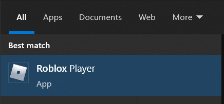

Next, right click the item and press **Open file location**.

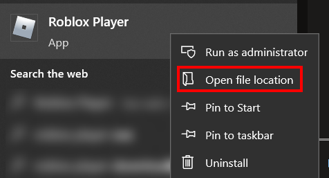

Now, you're in the folder that most likely has Roblox & Roblox Studio. Right click Roblox Player, and press Open file location (again).

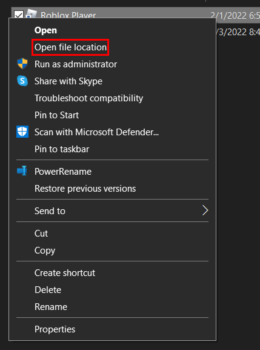

You're *finally* in the Roblox folder. From there, open up ExtraContent.

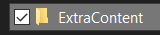

Inside of ExtraContent, there will be a folder called LuaPackages. Right click it, and press Copy.

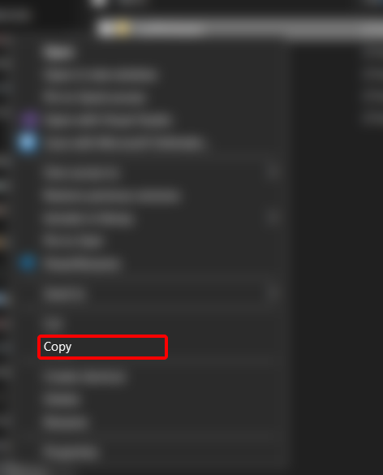

# set up the project

From there, make a new folder somewhere on your computer. Then, open it up in VS Code.

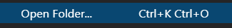

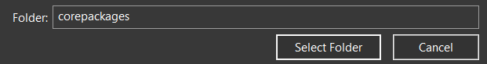

You *may* see a popup seeing if you trust the authors of this. Just click that blue button, because I'm assuming you trust yourself.

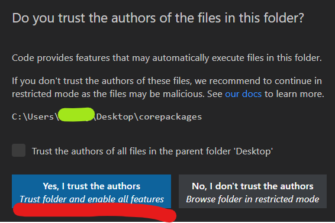

Assuming you have the Rojo VS Code plugin installed, press Ctrl+Shift+P and then type Rojo: Initialize. Press enter.

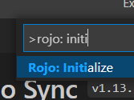

You should see something called default.project.json was created. Remove everything that's inside of it, and paste this in instead.

```json
{
  "name": "corepackages",
  "tree": {
    "$className": "DataModel",

    "ReplicatedStorage": {
      "$className": "ReplicatedStorage",
      "Common": {
        "$path": "src/shared"
      }
    }
  }
}
```

Your `default.project.json` should now look like this:

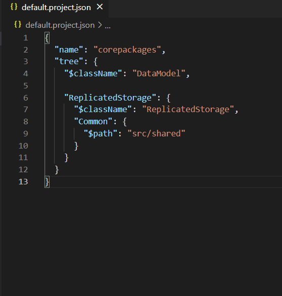

With all of that out of the way, remove every inside the `src` folder and make a folder inside of `src` called `shared`. Your setup should look like this:

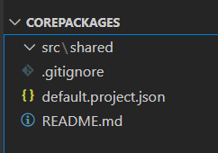

*note: <a href="#get-the-core-packages">since you had to copy the json to your clipboard you have to re-copy LuaPackages. please do that</a>*

Inside of `src/shared`, paste LuaPackages in.

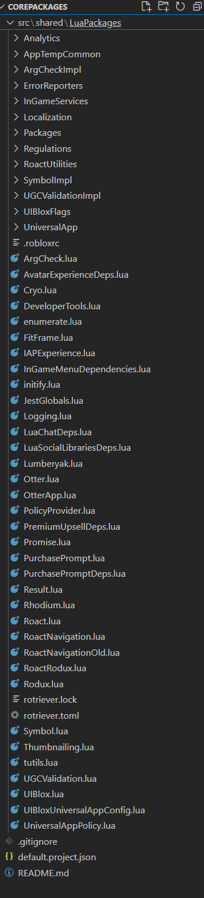

# get rojo plugin

Now that all of that is done, we need to install the Roblox plugin. **(do not close VS Code!!)**

You can find the <a href="https://github.com/rojo-rbx/rojo/releases/latest">latest release</a> on the rojo repo. Click Rojo.rbxm, and it should start the installation.

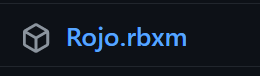

Once the installation is complete, show it in the folder (I use edge, you can do this with other browsers too.)

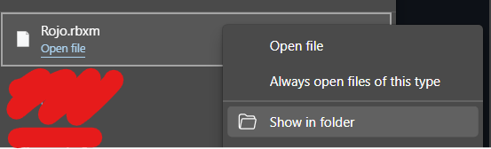

From there, right click it and press `Copy`.

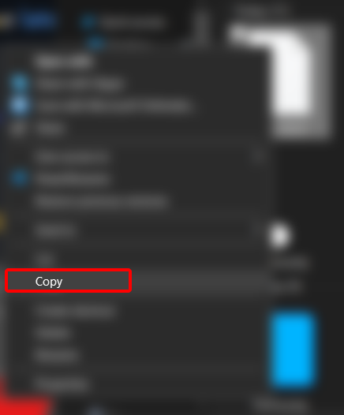

Next, open Roblox Studio and make a new Baseplate. Then, click the `PLUGINS` tab and open the plugin folder.

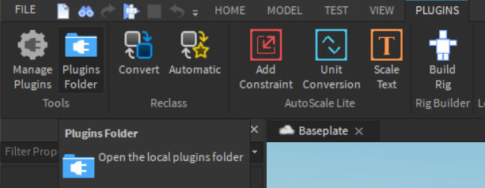

Paste Rojo.rbxm into the folder, and then reopen studio (and open a new Baseplate).

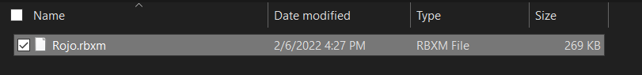

# finish importing

Next, open the Rojo widget. Then, go back to VS Code. Press Ctrl+Shift+P and type `star`. Make sure you pick `Rojo: Start server with project file`, and then press Enter. Then press Enter again.

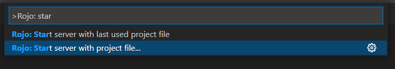

# fix version

Back to studio. Press `Connect` on the Rojo widget.

***Uh oh!*** We didn't set the Rojo version correctly. You should get an error like this:

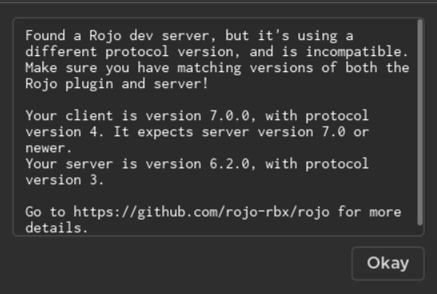

Stop the server from VScode.

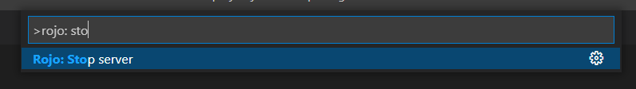

Go into the extensions tab. Press the little gear on rojo, and press Extension Settings.

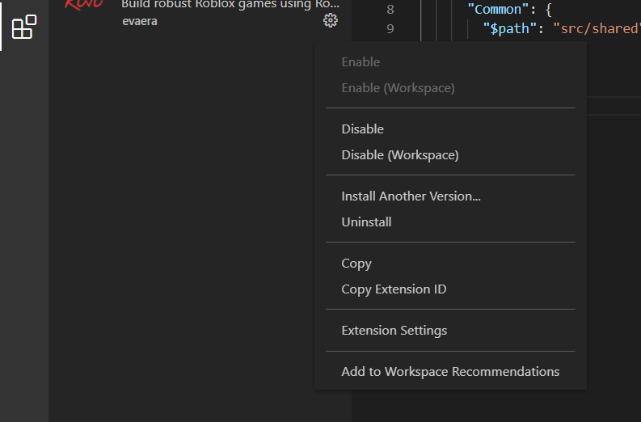

From there, change the release to the newest one.

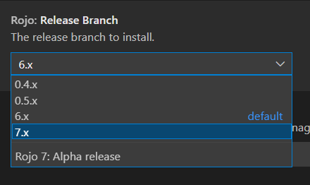

Now, start the server again.

# fixed.

Go back into studio, and connect. After studio freezes, everything will be in ReplicatedStorage inside of a folder titled Common. You can stop the rojo server & delete the folder, as we won't need it now.

# using uiblox

After finally getting the CorePackagaes imported, now it's time to use them.

<a href="https://taintedtim.github.io/taintedtim/use">Move On</a>